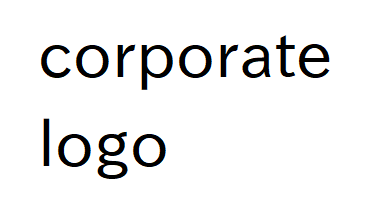

# 議事録 #【案件番号】　新規システムプロジェクト <!-- omit in toc -->

   
      <b>Confidential 機密情報（グループ外秘）</b>
   

   

    

## 目次 <!-- omit in toc -->

- [会議情報](#会議情報)
- [出席者](#出席者)
  - [会社A](#会社a)
  - [会社B](#会社b)
- [議題](#議題)
  - [議題1](#議題1)
  - [議題2](#議題2)
  - [議題3](#議題3)
- [今回決定事項](#今回決定事項)
- [資料](#資料)
- [課題](#課題)
  - [〇〇について確認](#〇〇について確認)
  - [××の調査](#の調査)
- [次回議題](#次回議題)
- [次回開催日](#次回開催日)
- [議事録作成者](#議事録作成者)
- [議事録承認者](#議事録承認者)
- [その他](#その他)

## 会議情報

- 議事番号 : n
- 会議名 : タイトル
- 対象システム : 対象システム名
- 日付 : yyyy/MM/dd（曜）
- 時間 : 00:00～00:00
- 会議場所 : オンライン
- 進行 : 名前
- 特記事項 : ***敬称略***

## 出席者

### 会社A

- 名前

### 会社B

- 名前

## 議題

### 議題1

- aaa
  - bbb
  - ccc

### 議題2

- aaa
  - bbb
  - ccc

### 議題3

- aaa
  - bbb
  - ccc

## 今回決定事項

1. 決定事項1

## 資料

1. アジェンダ.pptx
2.

## 課題

### 〇〇について確認

- 担当者 : 名前
- 内容 : 課題の内容 課題の内容

### ××の調査

- 担当者 : 名前
- 内容 : 課題の内容 課題の内容

## 次回議題

- 次回議題内容

## 次回開催日

- 日付 : yyyy/MM/dd（曜）
- 時間 : 00:00～00:00

## 議事録作成者

- 作成日 : yyyy/MM/dd（曜）
- 作成者 : 名前

## 議事録承認者

- 確認日 : yyyy/MM/dd（曜）
- 確認者 : 名前

## その他

- なし
